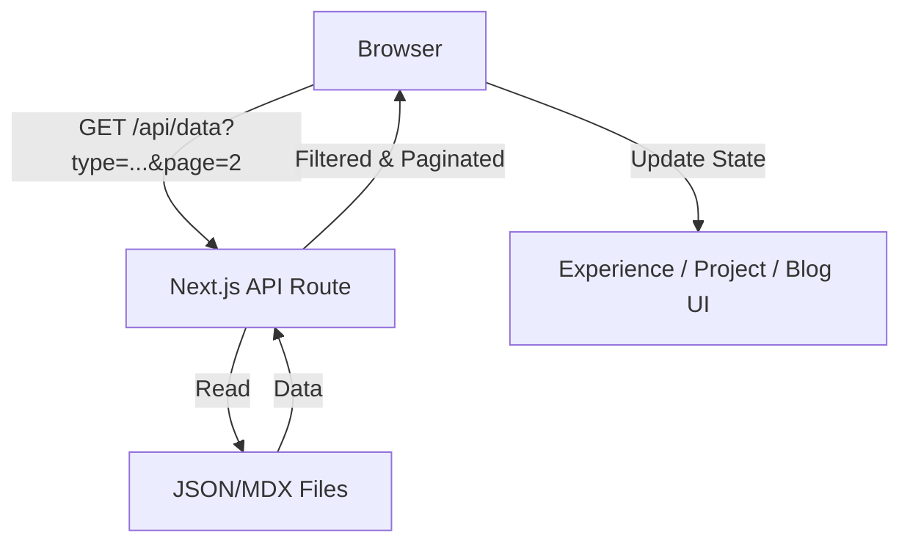

# Requirements

### Overview & Goals
The goal is to improve the loading performance of the website by fetching data (formations, projects, blog posts, and experience items) in a paginated way as the user scrolls down (infinite scroll) instead of loading all items at once. Additionally, the system will support multi-language content (Spanish and English) for all these items.

### Scope
- **In Scope:**
  - Creation of a local API to serve paginated and localized data.
  - Support for Spanish (ES) and English (EN) versions of all content items.
  - Implementation of infinite scroll on the Experience, Formation, Projects, and Blog pages.
  - Server-side filtering and localization to support correct pagination of filtered results.
- **Out of Scope:**
  - Migrating data from local files to a database.
  - Changing the visual design of the components (except for adding loading indicators).
  - URL-based i18n (e.g., `/en/blog`). Language will be managed via the existing `LanguageProvider`.

# Technical Design

### Current Implementation
- Data is fetched entirely on the server via `readJsonFile` or `getPosts` and passed to client components.
- Filtering and searching are performed entirely on the client side on the full dataset.
- All items are rendered at once, which can impact performance as the dataset grows.

### Proposed Changes

#### 1. Multi-language Data Structure
- **JSON files** (`app/experience/data.json`, `app/formation/data.json`, `app/projects/data.json`):
  - Refactor translatable fields (title, description, summary, location, highlight) to be objects with `es` and `en` keys.
- **MDX files** (`app/_posts/*.mdx`):
  - Use a filename suffix to distinguish languages (e.g., `my-post.es.mdx` and `my-post.en.mdx`).

#### 2. Unified API Route
- **Path:** `app/api/data/route.ts`
- **Purpose:** Serve paginated, filtered, and localized data.
- **Parameters:**
  - `type`: `formation | project | post | experience`
  - `lang`: `es | en`
  - `page`: Page number
  - `limit`: Items per page
  - `search`: Search string
  - `tags`: Comma-separated tags
- **Logic:**
  - Read files and filter by `type` and `lang`.
  - Apply search and tag filters on the localized content.
  - Return paginated results with metadata (`totalItems`, `totalPages`, `hasMore`).

#### 3. Infinite Scroll Logic
- **Hook:** `useInfiniteScroll`
  - Uses `IntersectionObserver` to detect the end of the list.
  - Includes `language` as a dependency to trigger re-fetches on language change.
  - Appends new items to the existing list.

#### 4. Component Refactoring
- Components will use `useLanguage()` to pass the current language to the `useInfiniteScroll` hook.
- Filtering UI will trigger API calls with the current language.
- Initial data passed from server components will default to Spanish (matching existing behavior) or be re-fetched immediately on the client if a different preference is found.

### Architecture Diagram

### Risks & Mitigations
- **SEO:** Initial data must still be rendered on the server. *Mitigation:* Pass the first page of data as initial props from the server component.
- **Filtering Lag:** Moving filtering to the server adds a network roundtrip. *Mitigation:* Use debouncing on the search input and show immediate loading states.
- **Tag List:** Client needs to know all available tags for the filter UI. *Mitigation:* Pass the full list of unique tags from the server component as props.

# Delivery Steps

### ✓ Step 1: Refactor Data for Multi-language Support
Refactor the existing JSON and MDX files to support both Spanish and English content.

- Update `app/experience/data.json`, `app/formation/data.json`, and `app/projects/data.json` to use objects with `es` and `en` keys for translatable fields.
- Rename existing MDX files in `app/_posts/` to include `.es.mdx` suffix and create their `.en.mdx` counterparts.
- Ensure all content has at least a placeholder or translated version in both languages.

### ✓ Step 2: Implement Paginated API Route
Implement a unified API endpoint to fetch data for different sections of the website.

- Create `app/api/data/route.ts` that accepts `type`, `lang`, `page`, `limit`, `search`, and `tags` as query parameters.
- Implement server-side logic to read the refactored JSON/MDX files.
- Integrate the filtering logic (normalized search and tag matching) into the API.
- Ensure the API returns metadata such as `totalItems`, `totalPages`, and `hasMore`.

### ✓ Step 3: Create Infinite Scroll Hook
Create a reusable hook to manage infinite scrolling logic.

- Implement `useInfiniteScroll` in `app/_hooks/useInfiniteScroll.ts` using the `IntersectionObserver` API.
- Manage state for fetched items, current page, loading status, and if more data is available.
- Handle fetching new data from the API when the user scrolls to the bottom of the list.

### ✓ Step 4: Integrate Pagination and Infinite Scroll in UI
Update the formation, projects, blog, and experience components to support infinite scroll and localization.

- Refactor `Experience`, `Formation`, `Projects`, and `Posts` components to use the `useInfiniteScroll` hook and the current language from `LanguageProvider`.
- Update the page files to pass initial data (first page) and the full list of tags to the components.
- Connect the existing search and tag filter UI to trigger a reset and re-fetch from the API when filters change.
- Add a loading spinner or indicator at the bottom of the lists.