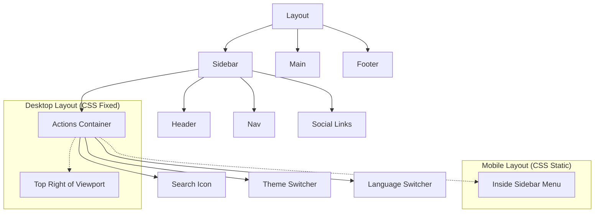

# Requirements

### Overview & Goals
The goal is to improve the user experience by relocating global actions (Search, Theme, Language) to more conventional and accessible locations.
- On **Desktop**, these actions should be in the upper right corner for easy access.
- On **Mobile**, they should be integrated into the sidebar menu to keep the main interface clean.

### Scope
- **In Scope**:
  - Relocating `GlobalSearch` icon.
  - Relocating `ThemeToggle` (Light/Dark mode).
  - Relocating `LanguageSwitcher`.
  - Creating a unified `Actions` container for these elements.
  - Updating Header, Footer, and Sidebar components.
- **Out of Scope**:
  - Changing the functionality of the search, theme, or language switchers.
  - Redesigning the search modal itself.

# Technical Design

### Current Implementation
- `GlobalSearch` is currently located in the `Header` component, which is a child of the `Sidebar`.
- `ThemeToggle` and `LanguageSwitcher` are located in the `Footer` component.
- The `Sidebar` is fixed on the left and has a togglable state (expanded/collapsed).

### Proposed Changes
1. **Unified Actions Component**:
   - Create `app/_components/header/Actions.tsx` to group the three toggles.
   - This ensures they always stay together regardless of the screen size.

2. **Responsive Placement Strategy**:
   - The `Actions` component will be added to the `Sidebar` component.
   - **On Desktop (> 768px)**: The `Actions` component will use `position: fixed` to place itself in the top-right corner of the viewport (`top: var(--gap)`, `right: var(--gap)`).
   - **On Mobile (<= 768px)**: The `Actions` component will be part of the normal document flow within the sidebar, making it visible only when the sidebar menu is expanded.

3. **Component Cleanup**:
   - Remove the relocated elements from `Header.tsx` and `Footer.tsx`.
   - Update `Header.module.scss` and `Footer.module.scss` to handle the empty space or layout shifts.

### File Structure Changes
- **New**: `app/_components/header/Actions.tsx`
- **New**: `app/_components/header/Actions.module.scss`
- **Modified**: `app/_components/header/Header.tsx`
- **Modified**: `app/_components/footer/Footer.tsx`
- **Modified**: `app/_components/sidebar/Sidebar.tsx`

### Architecture Diagram

# Testing

### Validation Approach
- **Desktop Check**:
  - Verify that the Search icon, Theme switcher, and Language switcher are visible in the top-right corner.
  - Verify they stay in place when scrolling.
  - Verify they work as intended (toggle theme, change language, open search).
- **Mobile Check**:
  - Verify that the actions are NOT visible in the top-right corner on small screens.
  - Open the sidebar menu and verify the actions are present inside.
  - Verify they work correctly within the sidebar context.
- **State Check**:
  - Verify that the actions behave correctly when the sidebar is collapsed/expanded on both desktop and mobile.

# Delivery Steps

### ✓ Step 1: Create the shared Actions component
- Create `app/_components/header/Actions.tsx` and `app/_components/header/Actions.module.scss`.
- Combine `GlobalSearch`, `ThemeToggle`, and `LanguageSwitcher` into the new `Actions` component.
- Implement responsive styling in `Actions.module.scss` to support fixed positioning on desktop and static layout for mobile.

### ✓ Step 2: Update existing components and integrate Actions into the Sidebar
- Remove `GlobalSearch` from `app/_components/header/Header.tsx`.
- Remove `ThemeToggle` and `LanguageSwitcher` from `app/_components/footer/Footer.tsx`.
- Import and add the `Actions` component to `app/_components/sidebar/Sidebar.tsx`.
- Adjust SCSS for Header and Footer to maintain layout balance after removing the elements.

### ✓ Step 3: Fine-tune positioning and responsiveness
- Refine the `Actions` component's fixed positioning on desktop to ensure it's in the "upper right" as requested.
- Ensure the `Actions` component is properly styled and visible within the sidebar on mobile when the menu is open.
- Verify that the search modal and toggles work correctly in their new locations.