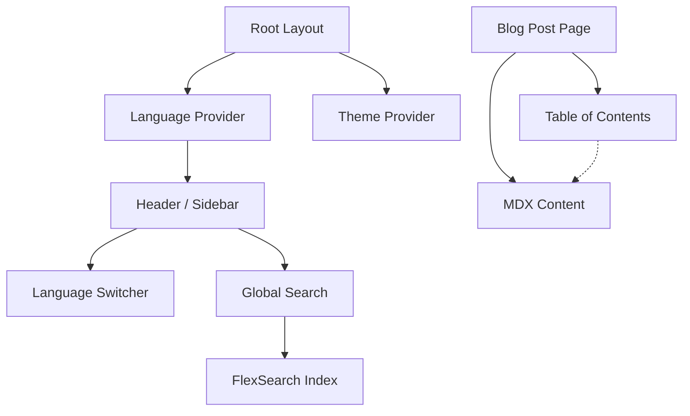

# Requirements

### Overview & Goals
The goal is to enhance the user experience and functionality of the personal website by improving the blog section, implementing a global search, adding multi-language support (ES/EN), and ensuring a robust responsive design.

### Scope
- **In Scope:**
    - Improved blog post search (indexing content).
    - Global site search (blog posts + projects).
    - Automatic and manual Table of Contents for blog posts.
    - Multi-language support (Spanish as default, English as secondary).
    - Responsive design audit and fixes.
    - Spec-driven design documentation.
- **Out of Scope:**
    - Translating actual blog post content (initially focused on UI and metadata).
    - Server-side search implementation (keeping it client-side for now).

### User Stories
- **As a reader**, I want to see a Table of Contents so that I can easily navigate through long blog posts.
- **As a visitor**, I want to search across the whole site so that I can find projects or posts related to a specific topic.
- **As a non-Spanish speaker**, I want the site to automatically show in English or allow me to switch so that I can understand the content.
- **As a mobile user**, I want a seamless navigation experience that adapts to my screen size.

# Technical Design

### Current Implementation
- **Tech Stack:** Next.js 15 (App Router), React 19, MDX (next-mdx-remote), SASS Modules.
- **Search:** Basic client-side filtering in `app/blog/components/Posts.tsx` based on metadata.
- **Language:** Hardcoded to Spanish (`<html lang="es">`).
- **ToC:** Not implemented.

### Key Decisions
1. **i18n Strategy:** Use a custom `LanguageProvider` and JSON files for simplicity, avoiding heavy libraries for just two languages.
2. **Search Engine:** Use `FlexSearch` for high-performance client-side indexing of MDX content and JSON data.
3. **ToC Extraction:** Extract headings from the raw MDX content before rendering or use a rehype plugin to collect them.
4. **Search UI:** Implement a modal/command-palette style search (Command+K) for the global search.

### Proposed Changes
- **New Components:**
    - `LanguageSwitcher`: Toggle between ES and EN.
    - `GlobalSearch`: Modal component with search input and results.
    - `ToC`: Sticky navigation component for blog posts.
- **Providers:**
    - `LanguageProvider`: Manages current language state and provides translation helper.
- **Utils:**
    - `search-index.ts`: Logic for indexing and searching content with FlexSearch.

### Architecture Diagram


### File Structure
```text
docs/specs/                 # Spec files
app/_providers/
  language/
    LanguageProvider.tsx    # i18n logic
app/_locales/
  es.json                   # Spanish translations
  en.json                   # English translations
app/_components/ui/
  search/
    GlobalSearch.tsx        # New global search
  toc/
    ToC.tsx                 # New ToC component
```

# Testing

### Validation Approach
- **i18n:** Verify browser language detection works; verify toggle updates all UI strings and persists in localStorage.
- **ToC:** Verify headings are correctly extracted; verify active section highlighting on scroll; verify click-to-scroll works.
- **Search:** Verify search results appear for both post metadata and content; verify global search includes projects; verify highlighting in results.
- **Responsive:** Test on Chrome DevTools mobile/tablet emulators (Small mobile, Large mobile, Tablet).

# Delivery Steps

### ✓ Step 1: Spec-Driven Setup & Audit
Set up the groundwork for the project improvements.

- Create `docs/specs/` directory.
- Create initial spec files for Language Switcher, Search, and ToC.
- Audit current responsiveness on mobile and tablet.
- Audit navigation structure and accessibility.

### ✓ Step 2: Implement Language Switcher (ES/EN)
Implement a robust i18n system for English and Spanish support.

- Create `LanguageProvider` following the `ThemeProvider` pattern.
- Implement browser language detection and persist selection in `localStorage`.
- Create JSON translation files for static strings (header, sidebar, nav, projects, etc.).
- Add a Language Switcher UI component in the sidebar.
- Update `app/layout.tsx` to set the `lang` attribute dynamically.

### ✓ Step 3: Implement Table of Contents (ToC)
Enhance the reading experience with an interactive Table of Contents.

- Create a `ToC` component for the blog post page.
- Implement heading extraction from MDX content (H1, H2, H3).
- Add scroll-spy functionality to highlight the active section.
- Ensure the ToC is responsive (sticky on desktop, collapsible/hidden on mobile).

### ✓ Step 4: Implement Global Search & Enhance Blog Search
Improve existing blog search and add a global search feature.

- Integrate `FlexSearch` for efficient client-side indexing.
- Improve blog search to include post content, not just metadata.
- Implement a global search modal (accessible via `/` or a UI button).
- Index both blog posts and projects in the global search.
- Add a visual results interface with snippets and highlighting.

### ✓ Step 5: Responsive & Navigation Polish
Polish the site's layout and navigation for all devices.

- Fix identified responsive issues in sidebar, headers, and grids.
- Improve navigation accessibility (aria-labels, keyboard support).
- Polish transitions and animations for a smoother UX.
- Final verification of all new features across different screen sizes.